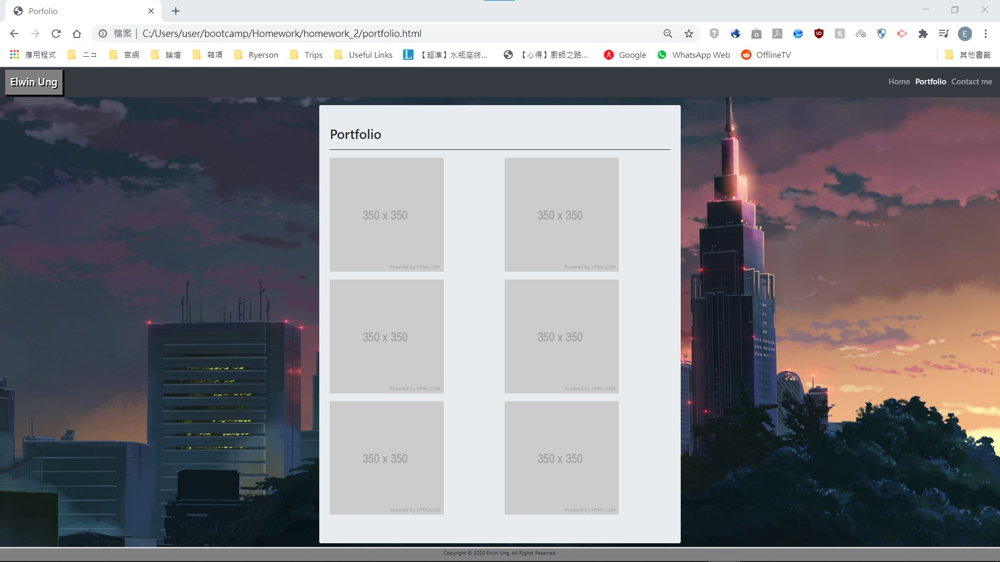
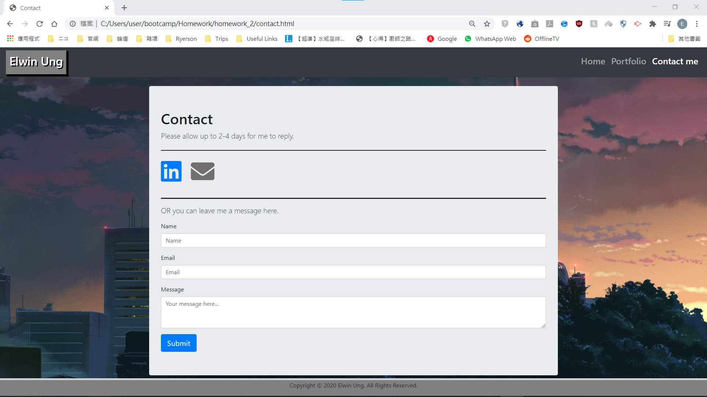

# Personal Website Prototype
This prototype contains the following html and css:
- index.html: The landing page with an "About Me" section
- portfolio.html: Project page for showcasing past projects with a thumbnail from those projects
- contact.html: Contact page contains ways to contact me or leave a message through the form provided
- style.css: CSS for styling all of the about html pages
Every html contains a **Bootstrap Navbar** and a customizable **footer**, which is used as a Copyright banner. 

This prototype made use of **HTML 5**, **CSS** and **Bootstrap**. 
This prototype is currently hosted on Github Pages: https://elwinung0120.github.io/Personal-Website-Prototype/

## Notes
Images below have different scaling in an attempt to showcase the whole page.

# index.html
- Made with **Jumbotron** and **Grid system** within Jumbotron

# portfolio.html
- Made with **Jumbotron** and **Grid system** within Jumbotron
- Thumbnails will rearrange themselves when window size is changed to below 768px

# contact.html
- Made with **Jumbotron** and **Form** within Jumbotron

# style.css
- Contains general styling for all 3 html pages
- Contains **Media Queries** to make all 3 html pages rearrange its components to match the different window sizes
